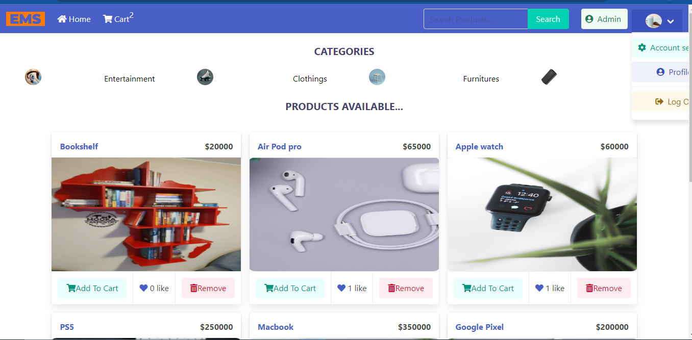
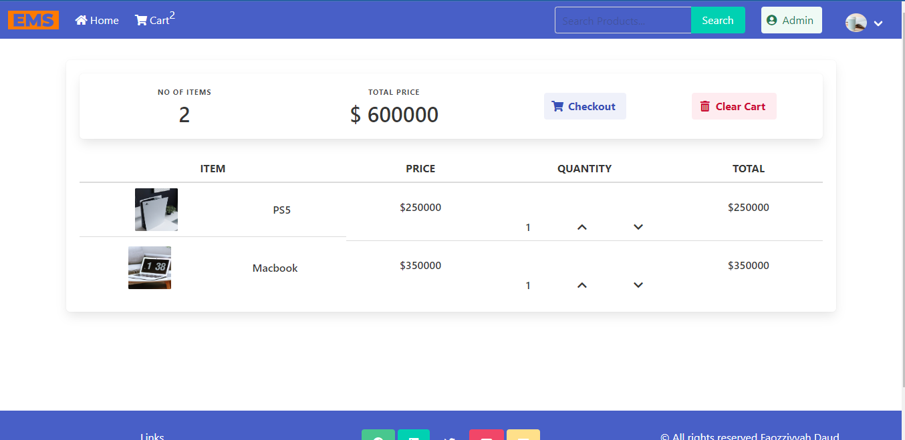
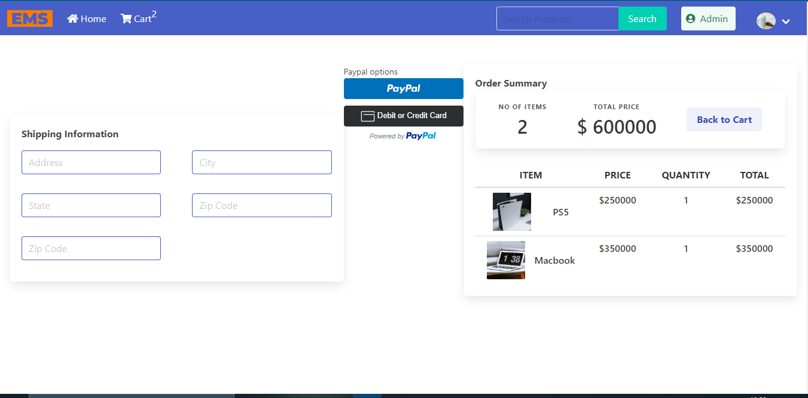

# E-Millenial Store

full stack CRUD E-Commerce website built with HTML, Bulma CSS, and Django framework with payment integration.  

## Table of contents

- [Overview](#overview)
  - [The challenge](#the-challenge)
  - [Screenshot](#screenshot)
  - [Links](#links)
- [My process](#my-process)
  - [Built with](#built-with)
  - [What I learned](#what-i-learned)
  - [Useful resources](#useful-resources)
- [To use](#usage)

## Overview

### The challenge

Users should be able to:

- Add an item to the cart.
- View each item.
- Update and clear the cart.
- Make payment with PayPal.
- View item categories.
- Login as a user and log out.
- Remove items and like items in the cart.
- Search for items in store.
- View the optimal layout for the site depending on their device's screen size

### Screenshot

### Links

- Solution URL: (https://github.com/faozziyyah/django-ecommerce-app)
- Live link: (not yet available)

## My process

### Built with

- HTML
- Bulma - CSS framework
- Django

### What I learned

- Django authentication and authorization
- How to use the Django Admin
- pagination
- Payment integration
### Useful resources

- [Django](https://www.djangoproject.com/) - Django makes it easier to build better web apps more quickly and with less code. 
- [Bulma CSS](https://bulma.io/documentation/) - Django makes it easier to build better web apps more quickly and with less code.
